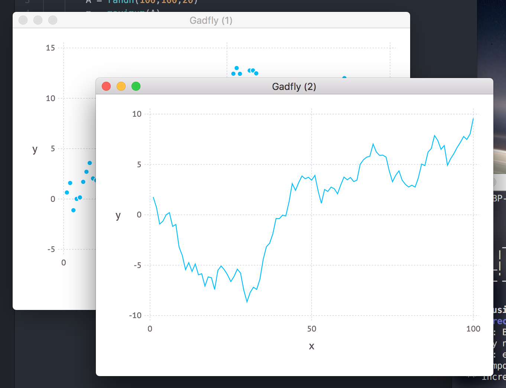
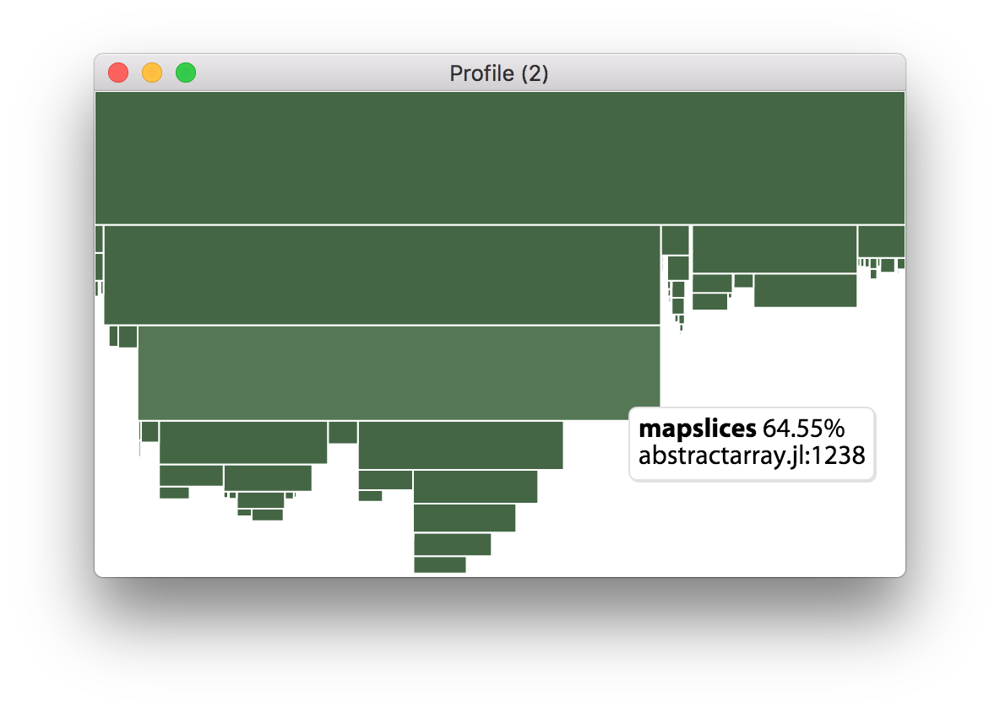
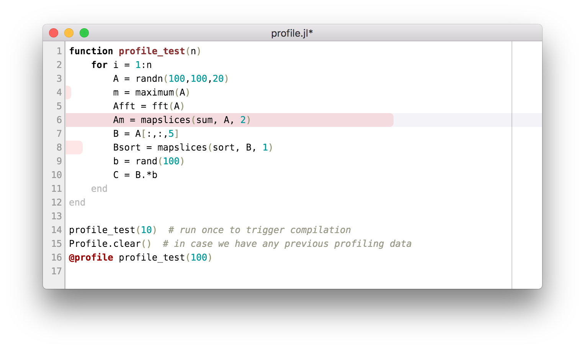

# DevTools

DevTools.jl provides a couple of useful graphical tools for working with Julia, built on top of [Blink.jl](https://github.com/JunoLab/Blink.jl).

```julia
Pkg.add("Blink")
Pkg.clone("https://github.com/JunoLab/DevTools.jl")
using DevTools
```

## Graphical Display

DevTools hooks into [Media.jl](https://github.com/JunoLab/Media.jl) to provide a graphical display for Julia types. Once DevTools, is loaded, plotting with [Gadfly](https://github.com/dcjones/Gadfly.jl) will open windows like this:

```julia
julia> using DevTools, Gadfly

julia> plot(x=1:100, y=cumsum(randn(100)))
```



There are a few utility functions that you can use to control this output, e.g. `pin()` will prevent new windows from being created (new plots will reuse an old window instead), and `top()` will set the last window to be always on top.

## The Profiler

Let's borrow an example from the excellent [ProfilerView.jl](https://github.com/timholy/ProfileView.jl).

```julia
# profile.jl
function profile_test(n)
    for i = 1:n
        A = randn(100,100,20)
        m = maximum(A)
        Afft = fft(A)
        Am = mapslices(sum, A, 2)
        B = A[:,:,5]
        Bsort = mapslices(sort, B, 1)
        b = rand(100)
        C = B.*b
    end
end

profile_test(10)  # run once to trigger compilation
Profile.clear()  # in case we have any previous profiling data
@profile profile_test(100)
```

With this saved in a file, execute:

```julia
julia> include("profile.jl")

julia> using DevTools

julia> profiler()
```

This will result in an open window which looks something like the following:



This plot represents your program, with each green cell being a line within a given function – hover over to see which. If a line in the program calls some function `f`, then lines from `f` will be displayed directly below the original line, scaled by the amount of time that they took. For example, the top line in this plot is part of the profiler itself, and the largest line below it comes from `profile.jl:6`, followed by `abstractarray.jl:1238` as shown above – this gives a pretty clear idea of where you should aim optimisations.

If you're interested in looking more deeply into Julia's libraries, you can zoom into the plot by scrolling and pan by dragging.

This is certainly nicer than working with a text dump, but there's actually an even better way. Clicking on the `profile.jl:6` cell opens up a view on that line:



This view immediately makes it clear where time is being spent in the program, without having to mentally map between profile output and code. This more flat view can also be convenient for the way it aggregates time taken over the entire run of the program.
